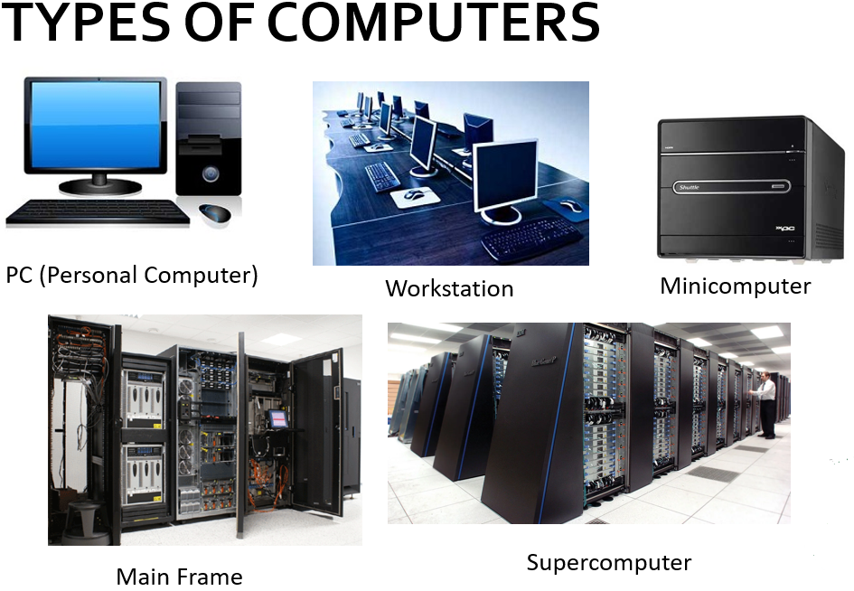
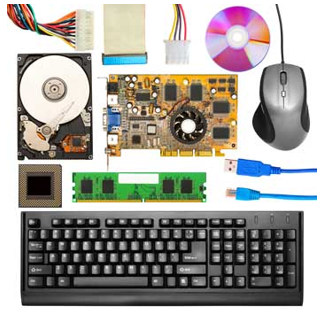
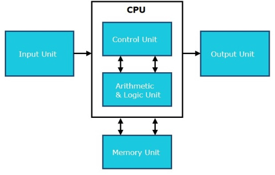
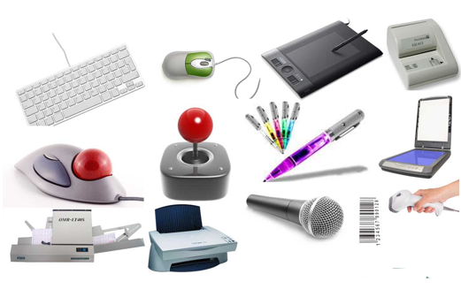
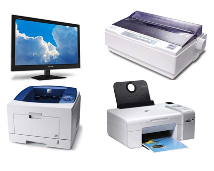
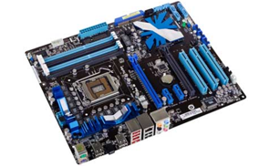
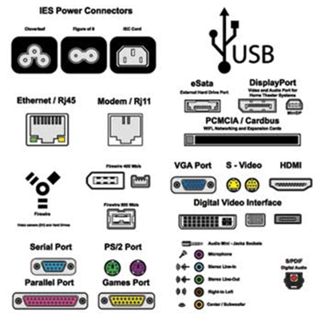

# Computer Fundamentals and Hardware

A **computer** is an electronic data processing device. It accepts data as input, stores and processes that data, and generates output in a required format.

---

## What is a Computer?

A computer is a device that:
- Accepts data as **input**
- Stores data and instructions in its **memory**
- **Processes** the data and converts it into useful information
- **Generates** the output
- **Controls** all the above steps

---

## Five Basic Functions of a Computer

Every digital computer performs these five functions:

1. **Takes data as input** - Receives information from users or other devices
2. **Stores data/instructions** - Saves information in memory for later use
3. **Processes the data** - Performs calculations and operations to convert input into useful information
4. **Generates the output** - Produces results in a format we can understand
5. **Controls all steps** - Manages and coordinates all operations

---

## Applications of Computers

Computers are used in many fields:

- **Business** - Payroll, budgeting, sales analysis, managing databases
- **Banking** - Online banking, ATM machines, financial transactions
- **Education** - Computer-based learning, student performance tracking
- **Healthcare** - Patient records, medical diagnosis, surgery
- **Engineering** - CAD design, structural analysis, architectural planning
- **Government** - Tax processing, voter records, weather forecasting

---

## Types of Computers

There are five main types:

1. **PC (Personal Computer)** - Single user, moderately powerful (like desktop/laptop)
2. **Workstation** - Single user, more powerful than PC (for professionals)
3. **Minicomputer** - Multi-user, supports hundreds of users
4. **Mainframe** - Multi-user, supports hundreds of users with different software technology
5. **Supercomputer** - Extremely fast, executes hundreds of millions of instructions per second

---

## Hardware Components

**Hardware** represents the physical and tangible components of a computer - things you can see and touch.

### Main Components:

#### 1. **CPU (Central Processing Unit)**
- Considered the "brain" of the computer
- Performs all data processing operations
- Has three parts:
  - **Memory/Storage Unit** - Stores data and instructions
  - **Control Unit** - Controls all computer operations
  - **ALU (Arithmetic Logic Unit)** - Performs calculations and logical operations

#### 2. **Input Devices**
Devices used to enter data into the computer:
- Keyboard, Mouse, Scanner
- Microphone, Webcam
- Touchscreen, Track Ball
- Barcode Reader, etc.

#### 3. **Output Devices**
Devices that display or produce results:
- Monitor, Printer
- Speaker, Projector
- Headphones, etc.

#### 4. **Memory**
Storage space where data and instructions are kept:

- **Cache Memory** - Fast temporary storage, acts as buffer between CPU and main memory
- **Primary Memory (RAM/ROM)** - Holds data currently being worked on (lost when power is off)
- **Secondary Memory** - Permanent storage (Hard disk, CD, DVD, USB)

#### 5. **Motherboard**
- The backbone of the computer
- Connects all components together (CPU, memory, hard drives, video card, etc.)
- Everything plugs into or connects through the motherboard

#### 6. **Ports**
- Physical connection points for external devices
- Examples: USB ports, HDMI ports, audio jacks
- Used to connect mouse, keyboard, monitor, speakers, etc.

---

## Memory Units

Memory capacity is measured in:

- **Bit** - Smallest unit (0 or 1)
- **Nibble** - 4 bits
- **Byte** - 8 bits (can store one character)
- **Word** - Group of bits (varies by computer, usually 8-96 bits)

---

## Summary

- **Computer** = Electronic device that processes data (input → process → output)
- **Hardware** = Physical components you can touch (CPU, memory, keyboard, monitor)
- **Five Functions** = Input, Store, Process, Output, Control
- **Five Types** = PC, Workstation, Minicomputer, Mainframe, Supercomputer
- **CPU** = Brain of computer (has Memory Unit, Control Unit, ALU)
- **Memory Types** = Cache (fast), Primary/RAM (temporary), Secondary (permanent)
- **Motherboard** = Connects all components together
