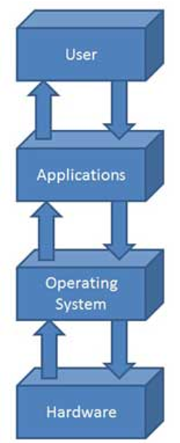
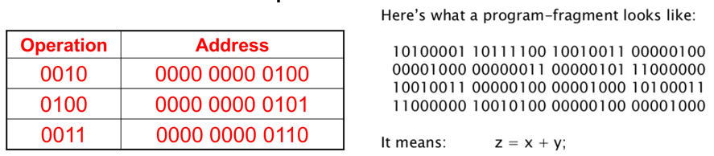
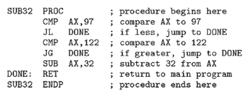
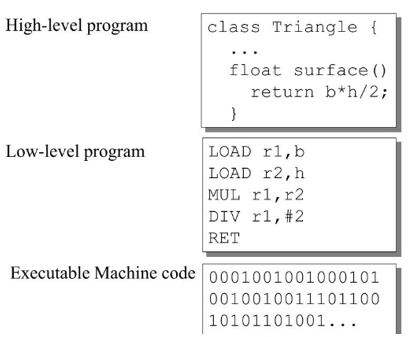

# Software and Programming Languages

**Software** is a set of programs designed to perform specific functions. A **program** is a sequence of instructions written to solve a problem.

---

## Types of Software

There are two main types:

### 1. **System Software**
Programs used to manage your computer:
- **Operating Systems** - Windows, Linux, macOS, Android, iOS
- Controls and monitors execution of all other programs
- Acts as interface between software and hardware

### 2. **Application Software**
Programs you apply to specific tasks:   
- Word processors, Spreadsheets
- Games, Web browsers
- Payroll programs, Inventory systems

---

## Operating Systems

An **Operating System** is a program that:
- Acts as an interface between software and computer hardware
- Manages overall resources and operations of the computer
- Controls and monitors execution of all other programs
- Allows application software to run properly

**Examples:** Windows, Linux, macOS, Android, iOS

---

## Program and Programming Languages

- **Program** - A set of instructions that the computer follows
- **Programming Language (PL)** - A standardized way to express instructions to a computer

**Examples:** C++, Java, Python, JavaScript, Visual Basic, Assembly Language

---

## Categories of Programming Languages

Programming languages are divided into three categories:

### 1. **Machine Language**
- The actual language the computer understands
- Written in **binary code** (0s and 1s)
- Very difficult for humans to read and write
- Each instruction directly tells the computer what to do

### 2. **Assembly Language**
- A symbolic representation of machine language
- Uses short words (mnemonics) instead of binary
- Converted to machine code by an **assembler**
- One line of assembly code = one machine instruction
- Harder than high-level languages, but more efficient

### 3. **High-Level Programming Language**
- Designed to be easier for humans to read and write
- Closer to human language (English-like)
- Must be converted to machine language before execution
- Uses a **compiler** or **interpreter** for translation
- Examples: Python, C++, Java, JavaScript, PHP, Ruby

---

## Uses of Programming Languages

Programming languages are used in many industries:

- **Software Development** - Creating applications and system software
- **Web Development** - Building websites (HTML, CSS, JavaScript)
- **Data Science** - Analyzing data (Python, R)
- **Game Development** - Creating video games (C++, C#)
- **Mobile Apps** - Building apps for phones (Java, Swift)
- **Artificial Intelligence** - Building smart systems (Python, C++)
- **Embedded Systems** - Programming small devices (C, Assembly)

---

## Summary

- **Software** = Programs that tell computer what to do
- **System Software** = Manages computer (Operating Systems)
- **Application Software** = Programs for specific tasks (Word, Games)
- **Operating System** = Interface between hardware and software
- **Programming Language** = Way to write instructions for computer
- **Three Categories** = Machine (binary), Assembly (symbolic), High-Level (human-readable)
- **High-Level Languages** = Easier to write, need compiler/interpreter to run
