# Selection Control Structures

**Selection structures** (also called conditional structures) allow a program to execute one or more statements when a condition is met. They control the flow of code execution based on different conditions in the program.

---

## What are Control Structures?

Control structures are the building blocks of computer programs. They are commands that enable a program to "take decisions," following one path or another.

There are **three basic control structures**:

1. **Sequence Structure** - Straightforward execution of one processing step after another
2. **Selection Structure** - Presentation of a condition, with choice between two actions depending on whether the condition is true or false
3. **Repetition Structure** - Presentation of a set of instructions to be performed repeatedly, as long as the condition is true

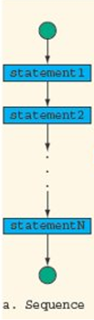

*Figure: Basic sequence control structure showing linear execution*  

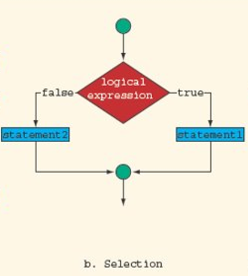

*Figure: Basic selection control structure showing decision-making*  

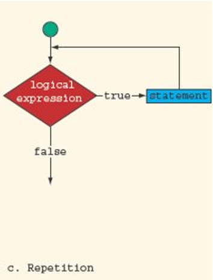

*Figure: Basic repetition control structure showing looping*  

---

## Selection Control Structures in C++

C++ provides several types of selection structures:

- **if** statements
- **if-else** statements
- **if-else if** statements
- **Nested if** statements
- **Switch** statements

---

## IF Statement

The **if statement** executes one or more statements when a condition is met. If the condition is **TRUE**, the statement(s) get executed. If it's **FALSE**, nothing happens.

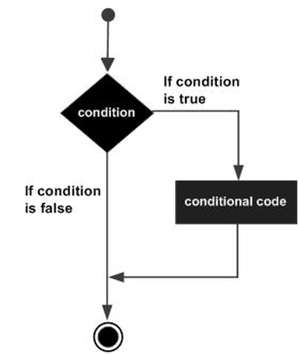

*Figure: Flowchart showing IF statement execution flow*  

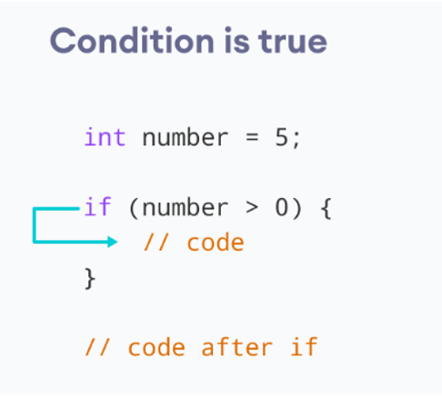

*Figure: Execution flow when IF condition is true*  

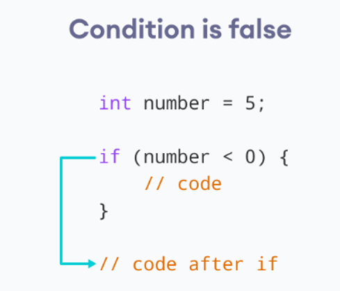

*Figure: Execution flow when IF condition is false - code block is skipped*  

### Syntax:

```cpp
if (<boolean expression>) {
    <statement>
}
```

or

```cpp
if (<boolean expression>) {
    <statement1>
    <statement2>
}
```

### Examples:

**Example 1:** Check if a number is positive

```cpp
#include <iostream>
using namespace std;

int main() {
    int x = 10;
    if (x >= 0) {
        cout << "variable x is a positive number";
    }
    return 0;
}
```

**Output:**
```
variable x is a positive number
```

**Example 2:** Compute absolute value

```cpp
#include <iostream>
using namespace std;

int main() {
    int x = -5;
    if (x < 0)
        x = -x;
    cout << "Absolute value: " << x << endl;
    return 0;
}
```

**Example 3:** Swap numbers in ascending order

```cpp
#include <iostream>
using namespace std;

int main() {
    int x = 10, y = 5;
    if (x > y) {
        int t = x;
        x = y;
        y = t;
    }
    cout << "x = " << x << ", y = " << y << endl;
    return 0;
}
```

---

## IF-ELSE Statement

The **if-else statement** allows a program to follow alternative paths of execution, whether a condition is met or not. It executes one set of statements if the condition is true, and another set if the condition is false.

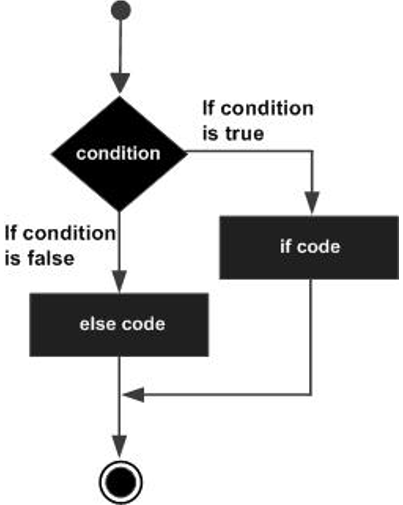

*Figure: Flowchart showing IF-ELSE statement with two execution paths*  

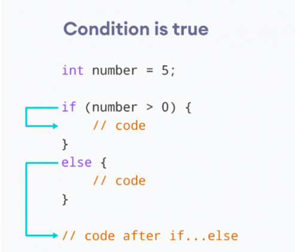

*Figure: Execution flow when IF condition is true - if block executes*  

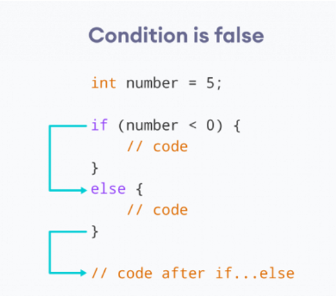

*Figure: Execution flow when IF condition is false - else block executes*  

### Syntax:

```cpp
if (<boolean expression>) {
    <statementT1>
    <statementT2>
}
else {
    <statementF1>
    <statementF2>
}
```

### Examples:

**Example 1:** Find the maximum of two numbers

```cpp
#include <iostream>
using namespace std;

int main() {
    int x = 15, y = 10, max;
    if (x > y)
        max = x;
    else
        max = y;
    cout << "Maximum is: " << max << endl;
    return 0;
}
```

**Example 2:** Display greeting based on time

```cpp
#include <iostream>
using namespace std;

int main() {
    int time = 20;
    if (time < 18) {
        cout << "Good day.";
    } else {
        cout << "Good evening.";
    }
    return 0;
}
```

**Output:**
```
Good evening.
```

**Example 3:** Calculate discount

```cpp
#include <iostream>
using namespace std;

int main() {
    int totalSpent = 150;
    float discountedPrice;
    if (totalSpent > 100) {
        discountedPrice = totalSpent * 0.8;
        cout << "You'll get a 20% discount" << endl;
    } else {
        discountedPrice = totalSpent * 0.9;
        cout << "You'll get a 10% discount" << endl;
    }
    cout << "Your discounted price is " << discountedPrice << endl;
    return 0;
}
```

---

## IF-ELSE IF Statement

The **if-else if statement** allows a user to decide among multiple options. The C++ if statements are executed from the top down. As soon as one of the conditions is true, the statement associated with that if is executed, and the rest of the else-if ladder is bypassed.

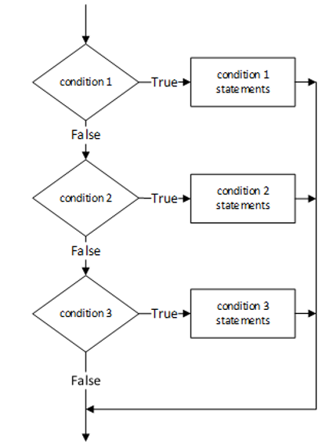

*Figure: Flowchart showing IF-ELSE IF statement with multiple conditions*  

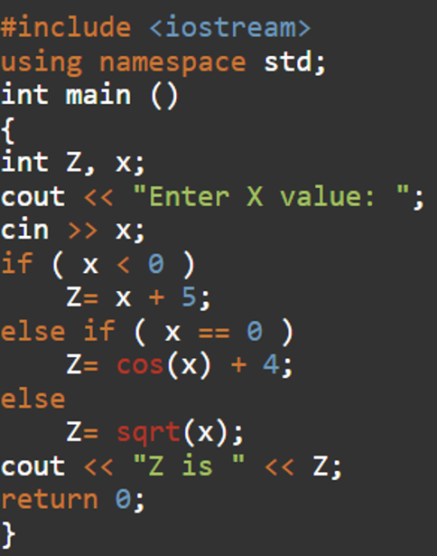

*Figure: Flowchart illustrating the logic for computing Z based on multiple conditions using if-else if*  

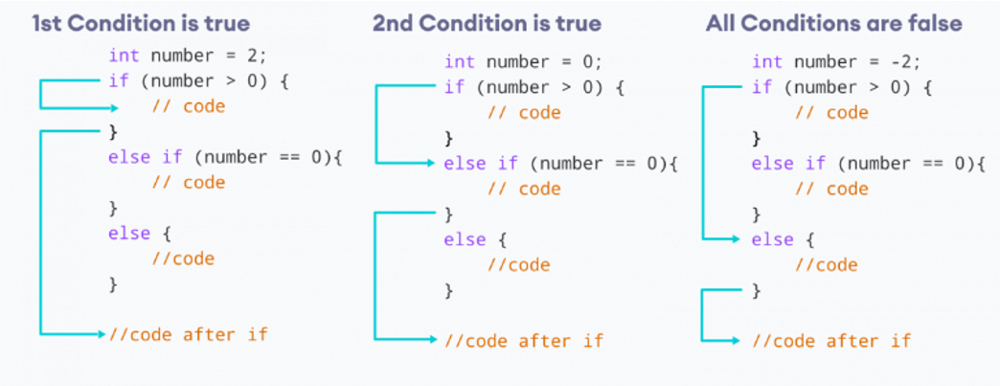

*Figure: Three scenarios showing execution flow when 1st condition is true, 2nd condition is true, or all conditions are false*  

### Syntax:

```cpp
if (<boolean expression>) {
    <statement>
}
else if (<boolean expression>) {
    <statement>
}
else if (<boolean expression>) {
    <statement>
}
...
else {
    <statement>
}
```

### Examples:

**Example 1:** Check value of x

```cpp
#include <iostream>
using namespace std;

int main() {
    int x = 30;
    if (x == 10) {
        cout << "Value of X is 10";
    }
    else if (x == 20) {
        cout << "Value of X is 20";
    }
    else if (x == 30) {
        cout << "Value of X is 30";
    }
    else {
        cout << "This is else statement";
    }
    return 0;
}
```

**Example 2:** Determine grade

```cpp
#include <iostream>
using namespace std;

int main() {
    int testResult = 85;
    char grade;
    if (testResult >= 90) {
        grade = 'A';
    }
    else if (testResult >= 80 && testResult < 90) {
        grade = 'B';
    }
    else if (testResult >= 70 && testResult < 80) {
        grade = 'C';
    }
    else {
        grade = 'D';
    }
    cout << "Grade: " << grade << endl;
    return 0;
}
```

**Example 3:** Check if character is uppercase or lowercase

```cpp
#include <iostream>
using namespace std;

int main() {
    char ch;
    cout << "Enter an alphabet:";
    cin >> ch;
    if ((ch >= 'A') && (ch <= 'Z'))
        cout << "The alphabet is in upper case";
    else if ((ch >= 'a') && (ch <= 'z'))
        cout << "The alphabet is in lower case";
    else
        cout << "It is not an alphabet";
    return 0;
}
```

---

## Nested IF Statements

A **nested if-else statement** contains one or more if-else statements. The if-else can be nested in three different ways:

1. **Nested within the if part**
2. **Nested within the else part**
3. **Nested within both the if and the else parts**

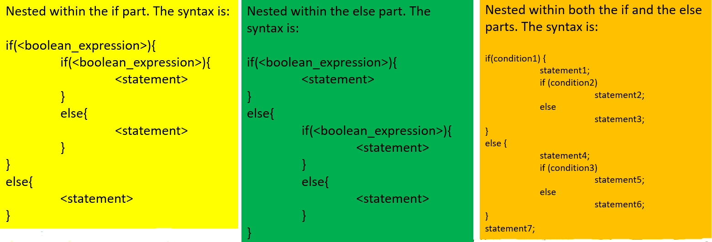

*Figure: Diagram showing different ways to nest IF statements*  

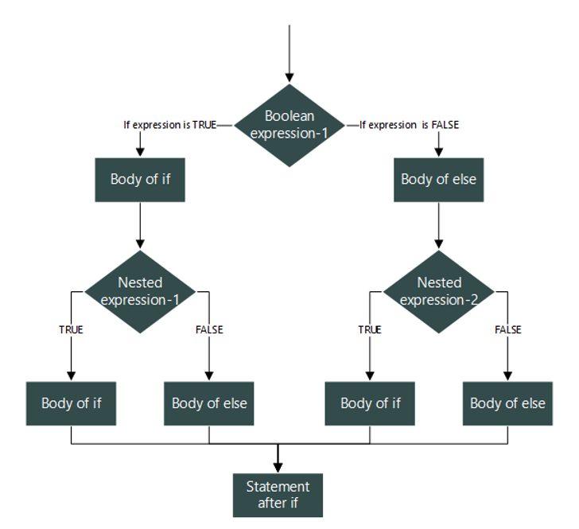

*Figure: Generic flowchart illustrating the logic of nested IF statements with two levels of conditions*  

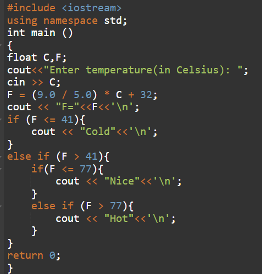

*Figure: C++ code example showing nested IF statements for temperature conversion and classification*  

### Syntax (Nested in if part):

```cpp
if (<boolean_expression>) {
    if (<boolean_expression>) {
        <statement>
    }
    else {
        <statement>
    }
}
else {
    <statement>
}
```

### Syntax (Nested in else part):

```cpp
if (<boolean_expression>) {
    <statement>
}
else {
    if (<boolean_expression>) {
        <statement>
    }
    else {
        <statement>
    }
}
```

### Examples:

**Example 1:** Age classification

```cpp
#include <iostream>
using namespace std;

int main() {
    int age = 18;
    if (age > 14) {
        if (age >= 18) {
            cout << "Adult";
        }
        else {
            cout << "Teenager";
        }
    }
    else {
        if (age > 0) {
            cout << "Child";
        }
        else {
            cout << "Something's wrong";
        }
    }
    return 0;
}
```

**Output:**
```
Adult
```

**Example 2:** Mark evaluation

```cpp
#include <iostream>
using namespace std;

int main() {
    int mark = 100;
    if (mark >= 50) {
        cout << "You passed." << endl;
        if (mark == 100) {
            cout << "Perfect!" << endl;
        }
    }
    else {
        cout << "You failed." << endl;
    }
    return 0;
}
```

**Output:**
```
You passed.
Perfect!
```

**Example 3:** Temperature conversion with classification

```cpp
#include <iostream>
using namespace std;
int main() {
    float C, F;
    cout << "Enter centigrade degree: ";
    cin >> C;
    F = (9.0/5.0) * C + 32;
    
    if (F <= 41)
        cout << "Cold";
    else if (F <= 77)
        cout << "Nice";
    else
        cout << "Hot";
    
    return 0;
}
```

---

## SWITCH Statement

The **switch statement** is a multiple-branch selection statement that successively tests the value of an expression against a list of integer or character constants. When a match is found, the statements associated with that constant are executed.

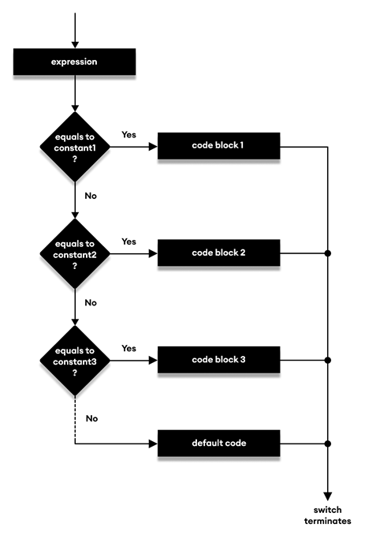

*Figure: Flowchart showing SWITCH statement logic with multiple case branches and default case*  

### Syntax:

```cpp
switch (expression) {
    case constant1:
        statement sequence 1;
        break;
    case constant2:
        statement sequence 2;
        break;
    case constant3:
        statement sequence 3;
        break;
    ...
    default:
        statement sequence n;
}
```

### Rules for Switch Statements:

- The expression must have an integral or enumerated type
- You can have any number of case statements
- Each case is followed by the value to be compared and a colon
- The constant-expression for a case must be the same data type as the variable in the switch
- When a match is found, statements execute until a `break` is reached
- A `break` statement causes the switch to terminate
- If no break appears, control falls through to subsequent cases
- The `default` case is optional and appears at the end

### Examples:

**Example 1:** Grade evaluation

```cpp
char grade = 'D';
switch (grade) {
    case 'A':
        cout << "Excellent!" << endl;
        break;
    case 'B':
        cout << "Well done" << endl;
        break;
    case 'C':
        cout << "You passed" << endl;
        break;
    case 'D':
        cout << "Better try again" << endl;
        break;
    case 'F':
        cout << "Better try again" << endl;
        break;
    default:
        cout << "Invalid grade" << endl;
}
cout << "Your grade is " << grade << endl;
```

**Example 2:** Day of week

```cpp
int dow;
cout << "Enter number of week's day (1-7): ";
cin >> dow;
switch (dow) {
    case 1:
        cout << "\nSunday";
        break;
    case 2:
        cout << "\nMonday";
        break;
    case 3:
        cout << "\nTuesday";
        break;
    case 4:
        cout << "\nWednesday";
        break;
    case 5:
        cout << "\nThursday";
        break;
    case 6:
        cout << "\nFriday";
        break;
    case 7:
        cout << "\nSaturday";
        break;
    default:
        cout << "\nWrong number of day";
}
```

**Example 3:** Simple calculator

```cpp
#include <iostream>
using namespace std;
int main() {
    char oper;
    float num1, num2;
    cout << "Enter an operator (+, -, *, /): ";
    cin >> oper;
    cout << "Enter two numbers: " << endl;
    cin >> num1 >> num2;
    
    switch (oper) {
        case '+':
            cout << num1 << " + " << num2 << " = " << num1 + num2;
            break;
        case '-':
            cout << num1 << " - " << num2 << " = " << num1 - num2;
            break;
        case '*':
            cout << num1 << " * " << num2 << " = " << num1 * num2;
            break;
        case '/':
            cout << num1 << " / " << num2 << " = " << num1 / num2;
            break;
        default:
            cout << "Error! The operator is not correct";
            break;
    }
    return 0;
}
```

---

## SWITCH vs IF-ELSE

Both switch and if-else are selection statements, but they have some differences:

| Feature | Switch | If-Else |
|---------|--------|---------|
| **Testing** | Can only test for equality | Can evaluate relational or logical expressions (multiple conditions) |
| **Variable** | Tests same variable against constants | Can use unrelated variables and complex expressions |
| **Versatility** | Less versatile | More versatile (can handle ranges) |
| **Data Types** | Integer and character only | Integer, character, and floating-point |
| **Case Values** | Must be constants | Can use expressions |
| **Efficiency** | More efficient when testing value against set of constants | More flexible but potentially less efficient |

**When to use Switch:**
- Testing a single variable against multiple constant values
- Integer or character comparisons
- When efficiency matters for multiple constant checks

**When to use If-Else:**
- Range checking (e.g., `if (x >= 10 && x <= 20)`)
- Multiple variable comparisons
- Floating-point comparisons
- Complex logical expressions

---

## Summary

Selection structures are essential for controlling program flow based on conditions:

- **if** - Executes code when condition is true
- **if-else** - Chooses between two paths
- **if-else if** - Chooses among multiple paths
- **Nested if** - Complex decision making
- **Switch** - Efficient multi-way selection based on constant values

Understanding these structures is fundamental to writing effective C++ programs that can make decisions and respond to different situations.

