# Repetition Control Structures

**Repetition structures**, or **loops**, are control structures that cause a statement or group of statements to be executed repeatedly. Many programming tasks are repetitive, having little variation from one item to the next. The process of performing the same task over and over again is called **iteration**.

---

## What are Repetition Structures?

A loop executes the same section of program code over and over again, as long as a loop condition of some sort is met with each iteration.

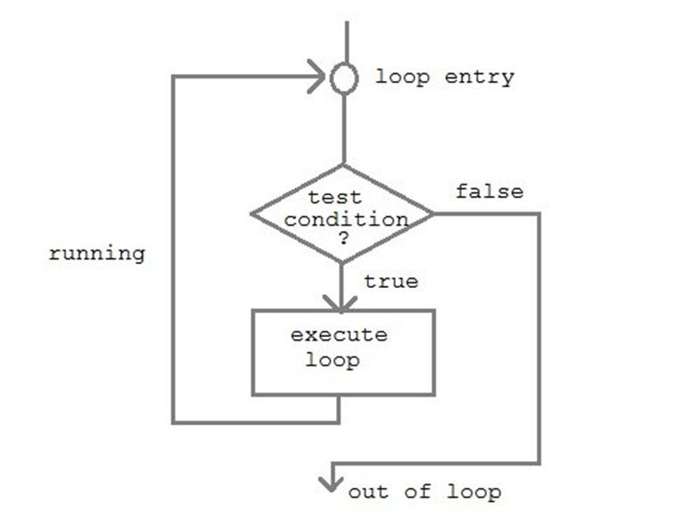

*Figure: Generic repetition control structure showing loop entry, test condition, execution, and termination*  

### Examples of When Loops are Used:

- To find the sum of a list of numbers - repeatedly get the next value and add it to a running total
- Monitoring a temperature reading - repeatedly input a reading until reaching a certain temperature
- Playing a guess-a-number game - repeatedly enter a guess until the correct number is guessed
- Playing an adventure game - repeatedly enter commands until reaching a goal or choosing to quit

---

## Types of Loops

There are basically two kinds of loops:

1. **Controlled loops** - Those that terminate
2. **Uncontrolled loops** - Those that do not terminate (infinite loops)

### Controlled Loops

A **controlled loop** contains some repetition condition which will eventually force the looping construct to terminate. This condition is called the **logical expression**.

Controlled loops may be classified as:

- **Count-controlled loops**
- **Event-controlled loops**

### Count-Controlled Loops

Count-controlled loops use a **counter** or **iterator** (also called **loop index**) which counts specific items or values and causes the execution of the loop to terminate when the counter has incremented or decremented a set number of times.

### Event-Controlled Loops

Event-controlled loops use an **event** to control the iteration of the loop. These events can be described using a logical expression. Types of event-controlled loops include:

1. **Sentinel-controlled** - Loop repeats until a certain value is entered
2. **End-of-file-controlled** - Loop terminates when end of file is detected
3. **Flag-controlled** - A bool variable serves as a flag, loop continues until flag flips

### Sentinel-Controlled Loops

These loops repeat until a certain value (sentinel) is entered. Common uses:

- Reading an unknown amount of input from the user
- Validating input

**Examples:**
```cpp
while (Value >= 0 && Value <= 10)
while (Upper < 'A' || Upper > 'Z')
while (letter != 'q')
```

### End-of-File-Controlled Loops

This type of loop is usually used when reading from a file. The loop terminates when the end of the file is detected.

**Example:**
```cpp
while (!fin.eof()) {
    // read and process data
}
```

### Flag-Controlled Loops

A bool variable is defined and initialized to serve as a flag. The loop continues until the flag variable value flips.

**Example:**
```cpp
bool nonNegative = true;  // Init flag
while (nonNegative) {      // Test if nonNegative is true
    cin >> value;
    if (value < 0)
        nonNegative = false;
}
```

---

## Loop Control Variable

All loops have a basic structure. There will be a variable (at least one) that controls how many times the loop runs. For each loop you write, you must:

1. **Initialize** the loop control variable - Should occur before the loop starts
2. **Test** the loop control variable - Done within the parenthesis of the loop statement
3. **Update** the loop control variable - Done somewhere inside the loop, usually as the last statement

---

## Types of Loops in C++

There are **three types of loops** in C++:

1. **while** loop
2. **for** loop
3. **do-while** loop

---

## WHILE Loop

The **while loop** tests a logical expression for exit of the loop at the beginning. If the expression evaluates to **true**, the statements are executed. If it evaluates to **false**, the statements are not executed.

Since the test is performed **before** the first instruction in the loop, the while loop is called a **pre-test loop**. This gives no guarantee that the loop will even execute once.

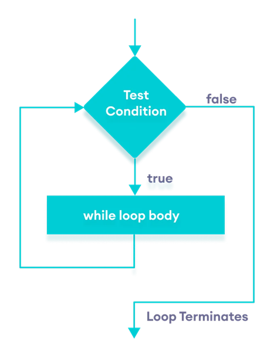

*Figure: While loop execution flow - test condition first, then execute loop body if true*  

### Syntax:

```cpp
while (condition) {
    // body of the loop
}
```

### Count-Controlled while Loop

The count-controlled while loop uses a loop control variable in the logical expression. The variable should be initialized before entering the loop, and a statement in the body should increment/decrement it.

**Example 1:** Sum of numbers from 1 to 99

```cpp
#include <iostream>
using namespace std;

int main() {
    int counter, sum;
    counter = 1;        // initialize the loop counter
    sum = 0;            // initialize the sum
    while (counter < 100) {  // iterate the loop 99 times
        sum = sum + counter; // add the value of counter to existing sum
        ++counter;           // increment the counter
    }
    cout << "The sum is " << sum << endl;
    return 0;
}
```

**Output:**
```
The sum is 4950
```

**Example 2:** Print numbers from 1 to 5

```cpp
#include <iostream>
using namespace std;
int main() {
    int i = 1;
    while (i <= 5) {  // while loop from 1 to 5
        cout << i << " ";
        ++i;
    }
    return 0;
}
```

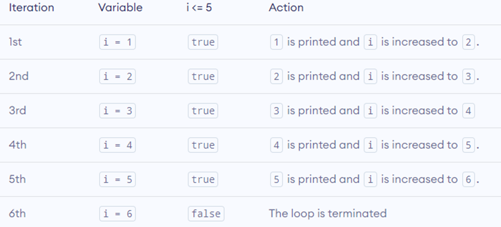

*Figure: Step-by-step execution trace showing how the while loop iterates from 1 to 5*  

**Output:**
```
1 2 3 4 5
```

**Example 3:** Count down from 10 to 1

```cpp
#include <iostream>
using namespace std;

int main() {
    int num = 10;       // initializing the variable
    while (num >= 1) {  // while loop with condition
        cout << num << endl;
        num--;          // decrementing operation
    }
    return 0;
}
```

**Output:**
```
10
9
8
7
6
5
4
3
2
1
```

**Example 4:** Print message 10 times

```cpp
#include <iostream>
using namespace std;

int main() {
    int loopCount;
    loopCount = 1;
    while (loopCount <= 10) {
        cout << "Hello! Loop count = " << loopCount << endl;
        loopCount++;  // Increment control variable
    }
    return 0;
}
```

---

### Sentinel-Controlled while Loop

**Example 1:** Count letters until 'q' is entered

```cpp
#include <iostream>
using namespace std;

int main() {
    char letter;        // storage for letters read
    int counter;        // counts the number of letters
    cin >> letter;     // read the first letter
    counter = 0;        // initialize the counter
    while (letter != 'q') {  // loop until 'q' is read
        ++counter;           // increment letter counter
        cin >> letter;       // read next letter
    }
    cout << "The number of letters read is " << counter << endl;
    return 0;
}
```

**Example 2:** Sum numbers until user says 'n'

```cpp
#include <iostream>
using namespace std;

int main() {
    int sum = 0;
    int num;
    char ans = 'Y';
    while (ans == 'Y' || ans == 'y') {
        cout << "Enter a number: ";
        cin >> num;
        sum += num;
        cout << "Try again[y/n]? ";
        cin >> ans;
    }
    return 0;
}
```

**Example 3:** Sum numbers until -1 is entered

```cpp
#include <iostream>
using namespace std;

int main() {
    int sum = 0;
    int num;
    cout << "Enter a number: ";
    cin >> num;
    while (num != -1) {
        sum += num;
        cout << "Enter a number: ";
        cin >> num;
    }
    cout << "Sum: " << sum << endl;
    return 0;
}
```

**Example 4:** Find greatest common divisor

```cpp
#include <iostream>
using namespace std;

int main() {
    int first, second, remainder;
    cout << "Enter two integers: ";
    cin >> first >> second;
    cout << "The greatest common divisor of " << first << " and " << second << " is ";
    remainder = first % second;  // Initialize
    while (remainder != 0) {     // Test
        first = second;          // Loop Process
        second = remainder;
        remainder = first % second;  // Update
    }
    cout << second << "." << endl;
    return 0;
}
```

---

### Nested while Loops

A while loop inside the body of another while loop is known as a **nested while loop**. One iteration of the outer loop is initially executed before the inner loop begins. The inner loop continues until its condition is satisfied. When the inner loop condition is satisfied, control returns to the outer loop for the next iteration.

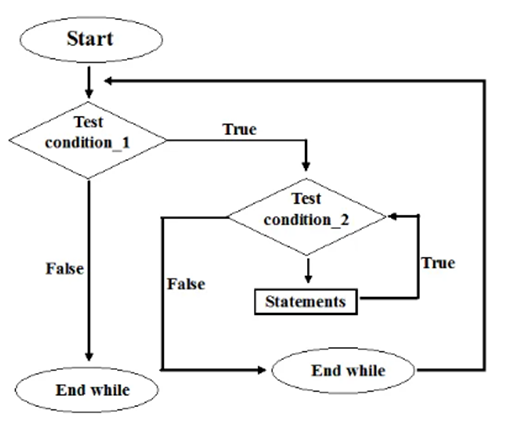

*Figure: Flowchart showing the structure and execution flow of nested while loops*  

**Syntax:**
```cpp
while (test_expression_1) {
    statement(s)
    while (test_expression_2) {
        statement(s)
    }
}
```

**Example 1:** Nested loops with counter

```cpp
#include <iostream>
using namespace std;
int main() {
    int i = 0;
    while (i <= 3) {
        cout << "outer loop executes" << endl;
        int j = 0;
        while (j <= 4) {
            cout << "inner loop executes";
            cout << " i = " << i << " and j = " << j << endl;
            j++;
        }
        i++;
    }
    return 0;
}
```

**Example 2:** Print pattern using nested loops

```cpp
#include <iostream>
using namespace std;
int main() {
    int i = 1;
    while (i <= 5) {
        int j = 1;
        while (j <= i) {
            cout << "*";
            j++;
        }
        cout << endl;
        i++;
    }
    return 0;
}
```

**Output:**
```
*
**
***
****
*****
```

**Example 3:** Print multiplication table

```cpp
#include <iostream>
using namespace std;
int main() {
    int i = 1;
    while (i <= 5) {
        int j = 1;
        while (j <= 5) {
            cout << i * j << "\t";
            j++;
        }
        cout << endl;
        i++;
    }
    return 0;
}
```

---

## DO-WHILE Loop

The **do-while loop** is a variant of the while loop with one important difference: the body of the do-while loop is **executed once before the condition is checked**.

**Flow:**
1. The body of the loop is executed at first
2. Then the condition is evaluated
3. If condition is **true**, the body executes again
4. This process continues until condition evaluates to **false**
5. Then the loop stops

Since the condition is checked **after** the first execution, the loop is guaranteed to execute **at least once**. This is called a **post-test loop**.

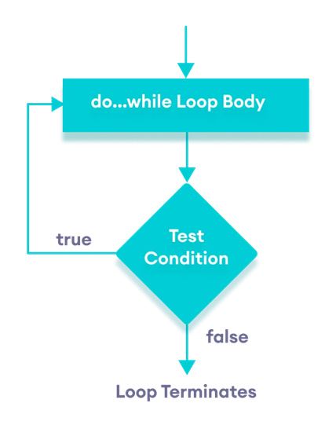

*Figure: Do-while loop execution flow - execute body first, then test condition*  

### Syntax:

```cpp
do {
    // body of loop;
}
while (condition);
```

### Examples:

**Example 1:** Print numbers from 1 to 5

```cpp
#include <iostream>
using namespace std;
int main() {
    int i = 1;
    do {
        cout << i << " ";
        ++i;
    } while (i <= 5);
    return 0;
}
```

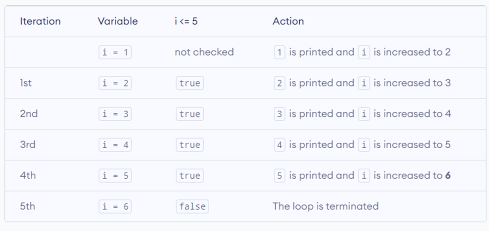

*Figure: Step-by-step execution trace showing how the do-while loop iterates from 1 to 5*  

**Output:**
```
1 2 3 4 5
```

**Example 2:** Sum positive numbers

```cpp
#include <iostream>
using namespace std;
int main() {
    int number = 0;
    int sum = 0;
    do {
        sum += number;
        cout << "Enter a number: ";
        cin >> number;
    } while (number >= 0);
    cout << "\nThe sum is " << sum << endl;
    return 0;
}
```

**Example 3:** Count letters until 'q' is entered

```cpp
#include <iostream>
using namespace std;

int main() {
    char letter;
    int counter;
    cout << "Enter a letter: ";
    cin >> letter;
    counter = 0;
    do {
        ++counter;
        cout << "Enter a letter: ";
        cin >> letter;
    } while (letter != 'q');
    cout << "The number of letters read is " << counter << endl;
    return 0;
}
```

**Example 4:** Calculate factorial

```cpp
#include <iostream>
using namespace std;
int main() {
    int factorial = 1;
    int counter;
    cout << "Enter a number: ";
    cin >> counter;
    do {
        factorial *= counter--;
    } while (counter > 0);
    cout << "factorial is " << factorial << endl;
    return 0;
}
```

---

## FOR Loop

The **for loop** is a repetition control structure that allows you to efficiently write a loop that needs to execute a specific number of times.

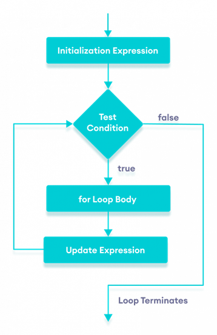

*Figure: For loop execution flow showing initialization, test condition, loop body, and update expression*  

### Flow of Control:

1. The **init step** is executed first, and only once. This allows you to declare and initialize loop control variables.
2. Next, the **condition** is evaluated. If **true**, the body executes. If **false**, the body doesn't execute and control jumps to the next statement.
3. After the body executes, the **increment** statement executes.
4. The condition is evaluated again. If **true**, the process repeats. After the condition becomes **false**, the for loop terminates.

### Syntax:

```cpp
for (init; condition; increment) {
    statement(s);
}
```

### Examples:

**Example 1:** Print numbers from 1 to 5

```cpp
#include <iostream>
using namespace std;
int main() {
    for (int i = 1; i <= 5; ++i) {
        cout << i << " ";
    }
    return 0;
}
```

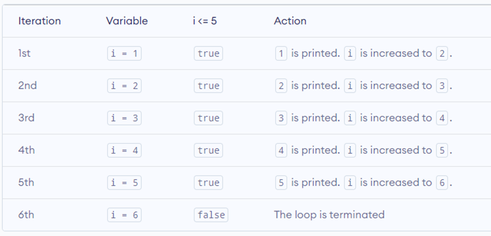

*Figure: Step-by-step execution trace showing how the for loop iterates from 1 to 5*  

**Output:**
```
1 2 3 4 5
```

**Example 2:** Sum of first n natural numbers

```cpp
#include <iostream>
using namespace std;
int main() {
    int num, sum;
    sum = 0;
    cout << "Enter a positive integer: ";
    cin >> num;
    for (int i = 1; i <= num; ++i) {
        sum += i;
    }
    cout << "Sum = " << sum << endl;
    return 0;
}
```

**Example 3:** Print values from 10 to 19

```cpp
#include <iostream>
using namespace std;
int main() {
    for (int a = 10; a < 20; a = a + 1) {
        cout << "value of a: " << a << endl;
    }
    return 0;
}
```

**Example 4:** Calculate factorial

```cpp
#include <iostream>
using namespace std;
int main() {
    int n, f = 1;
    cout << "Enter positive number: ";
    cin >> n;
    for (int i = n; i >= 2; i--)
        f = f * i;
    cout << "factorial is: " << f;
    return 0;
}
```

**Example 5:** Sum positive numbers from 10 inputs

```cpp
#include <iostream>
using namespace std;
int main() {
    int num, sum = 0;
    for (int i = 1; i <= 10; i++) {
        cout << "Enter your number: ";
        cin >> num;
        if (num > 0)
            sum = sum + num;
    }
    cout << "The sum is: " << sum;
    return 0;
}
```

**Example 6:** Print geometric series

```cpp
#include <iostream>
using namespace std;
int main() {
    int x;
    for (x = 1; x < 65; x *= 2)
        cout << x << " ";
    return 0;
}
```

**Output:**
```
1 2 4 8 16 32 64
```

### More About For Statement

**Multiple control variables:**

```cpp
for (int m = 1, int n = 8; m < n; m++, n--)
```

**Infinite loop:**

```cpp
for (;;) {
    // infinite loop
}
```

---

## NESTED FOR Loop

A loop inside another loop is called a **nested loop**. The number of loops depends on the complexity of the problem.

For each execution of the outer loop (running n times), the inner loop runs m times. So the total iterations would be n × m.

### Syntax:

```cpp
for (initialization; continuation condition; update) {
    for (initialization; continuation condition; update) {
        statement(s);
    }
    // you can put more statements
}
```

### Examples:

**Example 1:** Print grid pattern

```cpp
#include <iostream>
using namespace std;
int main() {
    int i, j;
    for (i = 0; i <= 5; i++) {
        for (j = 0; j <= 5; j++) {
            cout << i << j << "\t";
        }
        cout << "\n";
    }
    return 0;
}
```

**Example 2:** Print number pattern

```cpp
#include <iostream>
using namespace std;
int main() {
    int i, j;
    for (i = 1; i <= 5; i++) {
        for (j = 1; j <= i; j++) {
            cout << j;
        }
        cout << "\n";
    }
    return 0;
}
```

**Output:**
```
1
12
123
1234
12345
```

**Example 3:** Print plus sign pattern

```cpp
#include <iostream>
using namespace std;
int main() {
    int i, j;
    for (i = 1; i <= 10; i++) {
        for (j = 1; j <= i; j++) {
            cout << " + ";
        }
        cout << "\n";
    }
    return 0;
}
```

**Example 4:** Triple nested loop

```cpp
#include <iostream>
using namespace std;
int main() {
    int i, j, k;
    for (i = 1; i <= 2; i++) {
        for (j = 1; j <= 3; j++) {
            for (k = 1; k <= 4; k++)
                cout << " + ";
            cout << "\n";
        }
        cout << "\n";
    }
    return 0;
}
```

---

## Other Control Statements

### The BREAK Statement

The **break statement** causes an exit from a loop (and switch statements). The next statement executed is the one following the loop.

If you are using nested loops, the break statement will stop the execution of the **innermost loop** and start executing the next line of code after that block.

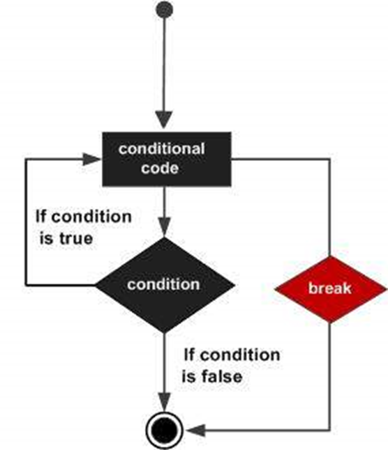

*Figure: Flowchart showing how the break statement causes immediate exit from a loop*  

**Example 1:** Break in do-while

```cpp
#include <iostream>
using namespace std;
int main() {
    int a = 10;
    do {
        cout << "value of a: " << a << endl;
        a = a + 1;
        if (a > 15) {
            break;  // terminate the loop
        }
    } while (a < 20);
    return 0;
}
```

**Output:**
```
value of a: 10
value of a: 11
value of a: 12
value of a: 13
value of a: 14
value of a: 15
```

**Example 2:** Find prime numbers

```cpp
#include <iostream>
using namespace std;
int main() {
    int i, j;
    for (i = 2; i < 100; i++) {
        for (j = 2; j <= (i/j); j++)
            if (!(i%j))
                break;  // if factor found, not prime
        if (j > (i/j))
            cout << i << " is prime\n";
    }
    return 0;
}
```

---

### The CONTINUE Statement

The **continue statement** works somewhat like the break statement. Instead of forcing termination, continue forces the **next iteration** of the loop to take place, skipping any code in between.

- For the **for loop**, continue causes the conditional test and increment portions to execute
- For the **while** and **do-while** loops, program control passes to the conditional tests

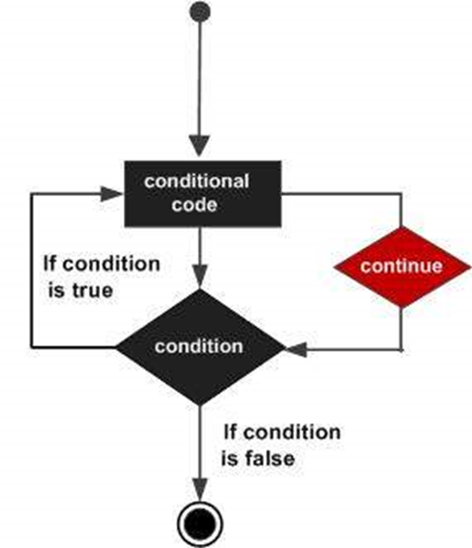

*Figure: Flowchart showing how the continue statement skips remaining code and jumps to the next iteration*  

**Example:**

```cpp
#include <iostream>
using namespace std;
int main() {
    int a = 10;
    do {
        if (a == 15) {
            a = a + 1;
            continue;  // skip the iteration
        }
        cout << "value of a: " << a << endl;
        a = a + 1;
    } while (a < 20);
    return 0;
}
```

**Output:**
```
value of a: 10
value of a: 11
value of a: 12
value of a: 13
value of a: 14
value of a: 16
value of a: 17
value of a: 18
value of a: 19
```

Notice that value 15 is skipped.

---

### The GOTO Statement

A **goto statement** provides an unconditional jump from the goto to a labeled statement in the same function.

**⚠️ NOTE:** Use of goto statement is highly discouraged because it makes it difficult to trace the control flow of a program, making the program hard to understand and hard to modify. Any program that uses a goto can be rewritten so that it doesn't need the goto.

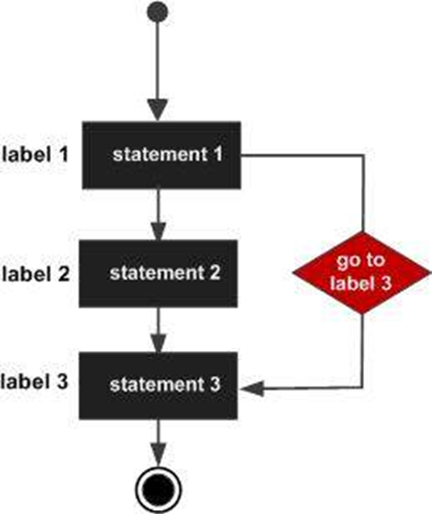

*Figure: Flowchart showing how the goto statement jumps to a labeled statement*  

**Syntax:**

```cpp
goto label;
...
label: statement;
```

**Example 1:**

```cpp
#include <iostream>
using namespace std;
int main() {
    ineligible:
    cout << "You are not eligible to vote!\n";
    cout << "Enter your age:\n";
    int age;
    cin >> age;
    if (age < 18) {
        goto ineligible;
    }
    else {
        cout << "You are eligible to vote!";
    }
}
```

**Example 2:** Using goto in loop

```cpp
#include <iostream>
using namespace std;
int main() {
    int a = 10;
    LOOP: do {
        if (a == 15) {
            a = a + 1;
            goto LOOP;
        }
        cout << "value of a: " << a << endl;
        a = a + 1;
    } while (a < 20);
    return 0;
}
```

---

## Summary

Repetition structures are essential for executing code multiple times:

- **while loop** - Pre-test loop, may not execute at all
- **do-while loop** - Post-test loop, executes at least once
- **for loop** - Efficient for count-controlled iterations
- **Nested loops** - Loops within loops for complex patterns
- **break** - Exit from loop
- **continue** - Skip to next iteration

Understanding these structures is fundamental to writing effective C++ programs that can perform repetitive tasks efficiently.

